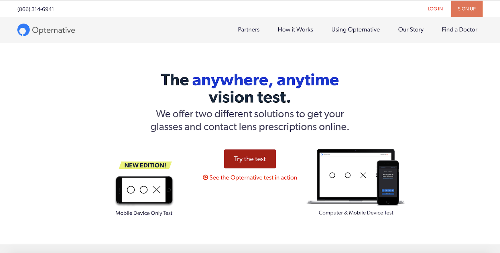

# VisionYourself

[VisionYourself](https://vision-y.herokuapp.com/) is a platform for users to get online prescription for glasses/contacts from an optometrist. It is inspired by [opternative.com](https://www.opternative.com/). The site is built with reactJS front-end and Node.js Express.js back-end.



The target audience of the visionYourself are optometrists. Basically, when a user wants an updated prescription but do not have the time to go to see an optometrist to take the tests on site, the optometrist can send their patients a link to do an online DIY eye test in their own free time and the results from the test will be sent to the optometrist where he can view and provide the patient an updated prescription.

## Getting Started

### Prerequisites

1. Install Node.js
2. Install PostgreSQL

### Setting Up

Install all dependencies

```
npm install
```

To run development mode:

```
npm run dev
```

On development mode, the front-end will be running on port 3000 whereas the back-end will run on port 8080. As such, to check out the project, go to localhost:3000.

To run production mode:

```
npm run build
npm start
```

On production mode, go to localhost:8080 to check out the project.

##Deployment
Deployment was a bit tricky for this project.

Firstly, create a heroku account:

```
heroku create [your app name]
```

Next, do the following:

```
heroku config:set NPM_CONFIG_PRODUCTION=false
```

- We had to set the config to false to prevent heroku from pruning the devDepencies. if you do not do this step, when running the app you will encounter an error saying webpack is not found.

Then, push the repo on heroku:

```
git push heroku
```

## Preview

Doctor
<br />
<br />


Patient
<br />
<br />
-Screen
<br />
<br />

<br />
<br />
-Remote
<br />
<br />

